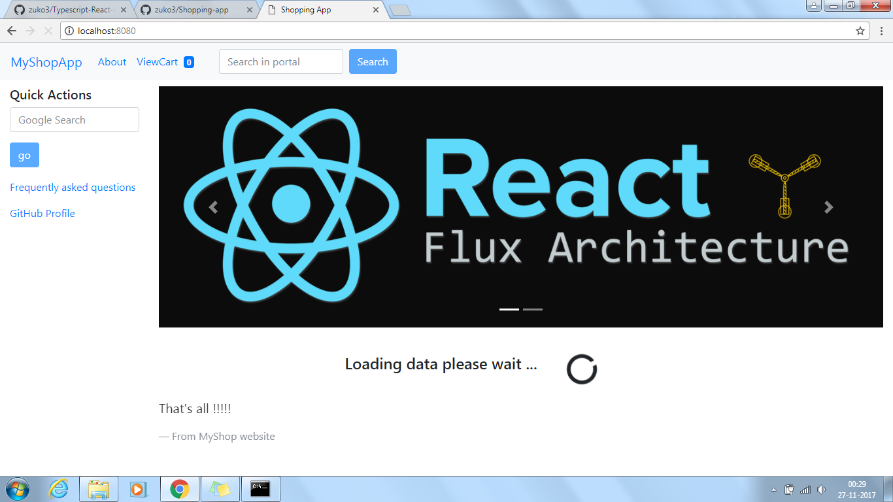
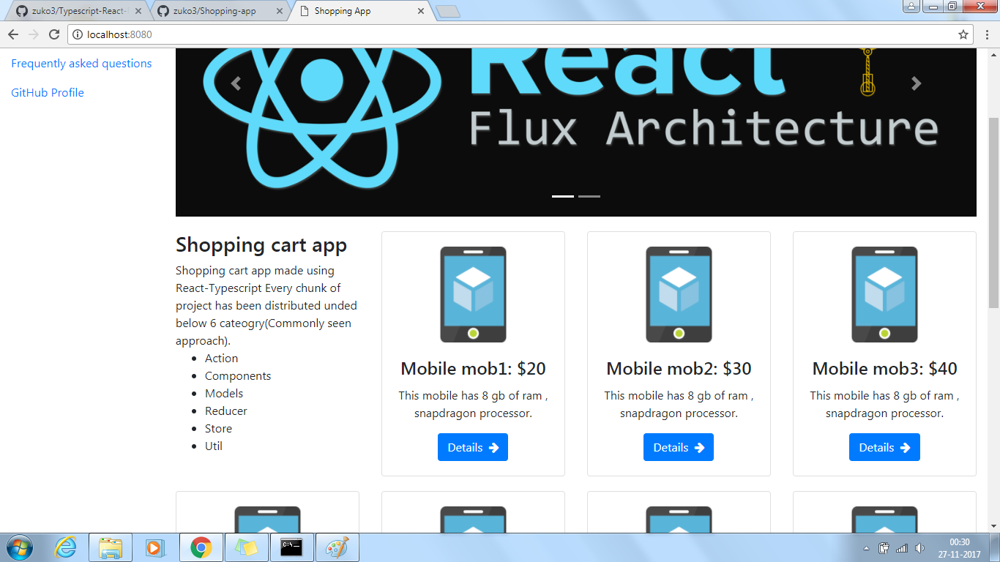
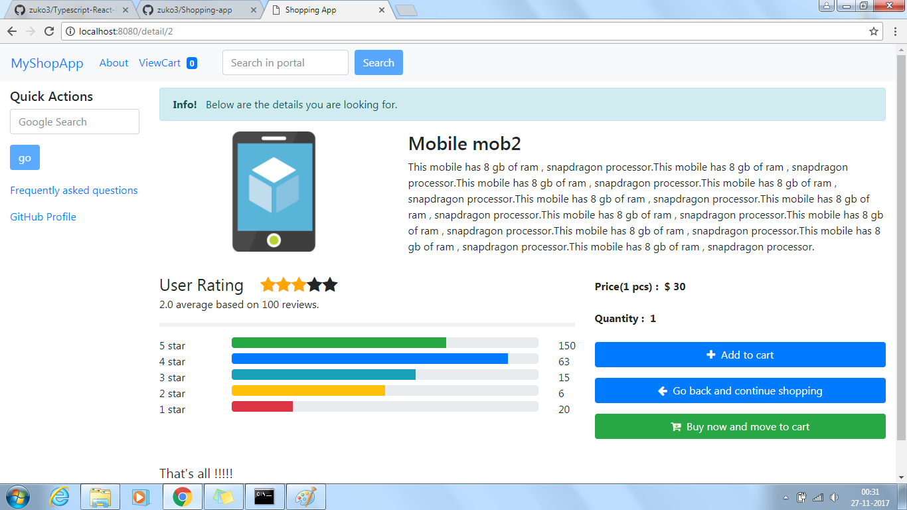
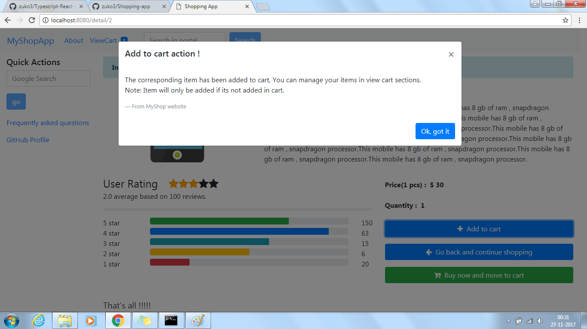
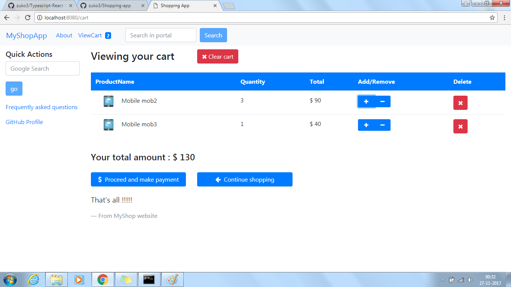
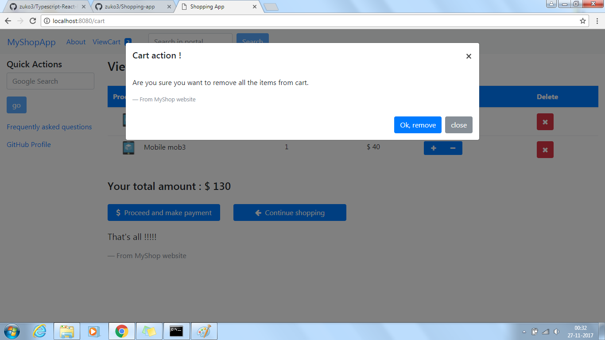
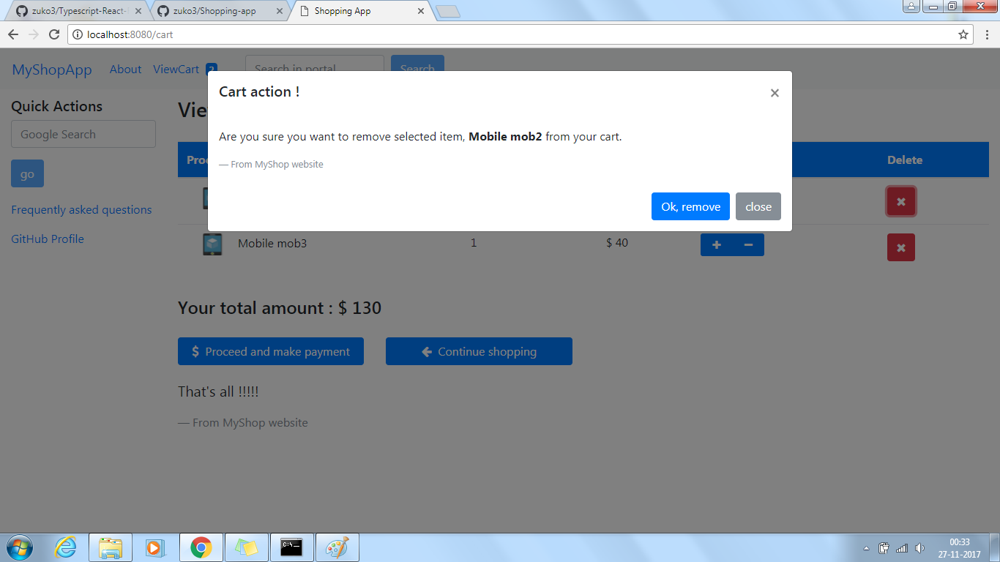
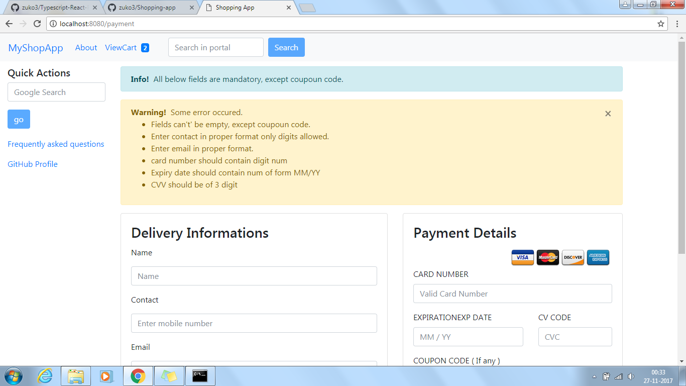
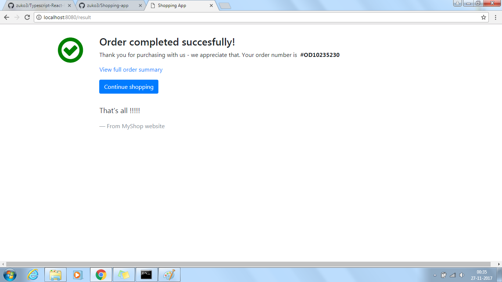
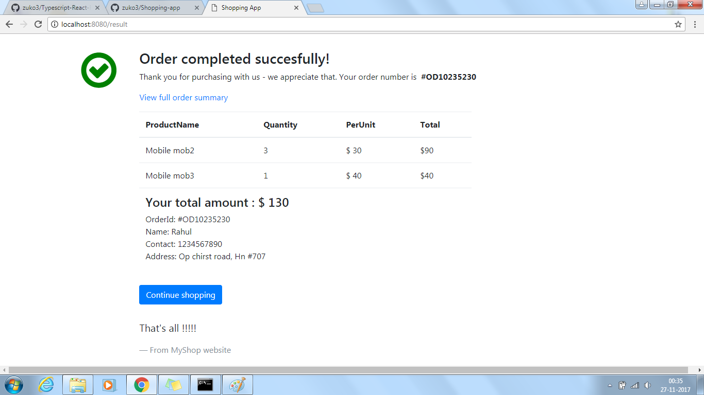

# Shopping-app
Shopping cart app made using React-Typescript-Redux, Bootstrap has been also been interagted.
Every code of project has been distributed unded below 6 cateogry, which is the most commonly seen approach for React-Typescript based application.
1.  Action
2. Components
3. Models
4. Reducer
5. Store
6. Util

# Some libraries used
1. react-redux , @types/react-redux (For Connecting React and Redux)
2. react-router, @types/react-router (For Routing)
3. redux-logger, @types/redux-logger (for Logging)
4. redux-promise-middleware, @types/redux-promise-middleware (for Async task)

# Integrating TypeScript With React.
  https://www.typescriptlang.org/docs/handbook/react-&-webpack.html
 
# Bootstrap used:
  https://v4-alpha.getbootstrap.com/components/alerts/
  
# For Integerating test case refer below project:
  https://github.com/zuko3/Typescript-React-Redux-Jest
  
# Connecting with back end:
  You can connect it with any backend just use end point in files under Action Folder.
  As of now dummy response has been embedded for working.
  
  
# Installation(window user):

1. Use & and copy in script stags in package.json file: "build": "webpack -d & copy src/index.html dist/index.html & webpack-  dev-server --content-base src/ --inline --hot --history-api- fallback", "build:prod": "webpack -p & copy src/index.html dist/index.html"

2. Run command npm install to install all dependency mentioned in package.json file.

# Installation(Mac user):

1. Use && and cp for( & ,copy) in script stags in package.json file: "build": "webpack -d & copy src/index.html dist/index.html &  webpack-dev-server --content-base src/ --inline --hot --history-api- fallback", "build:prod": "webpack -p & copy src/index.html dist/index.html"

2. Run command npm install to install all dependency mentioned in package.json file.

# ScreenShots for project.
1. HomePage Loading:
  

2. HomePage Renderd:
  

3. ProductDetail Page:
   
   
4. Add product succesful:
   
    
5. Cart page:
   
  
6. Empty Cart:
   
   
7. Remove item from Cart:
   
   
8. Checkout Page:
   
   
9. Order Placed Page:
   
   
10. Complete order page with summary:
    

